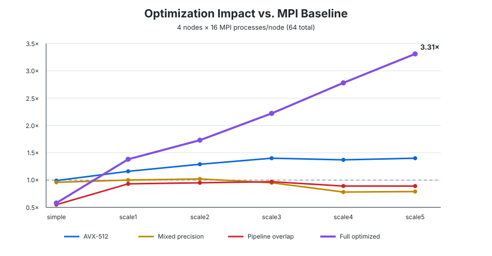
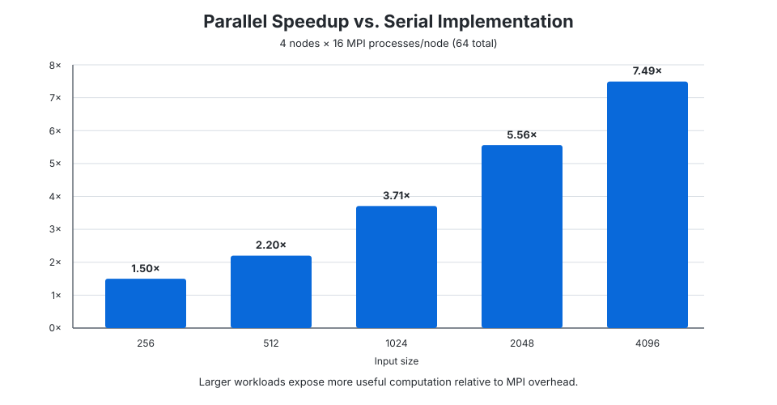

# Distributed Attention Optimization with MPI and AVX-512

A multi-node CPU implementation of **Standard Scaled Dot-Product Attention** in C, optimized with Open MPI and AVX-512.

$$
\mathrm{Attention}(Q,K,V)=\mathrm{softmax}\left(\frac{QK^{T}}{\sqrt{d_k}}\right)V
$$

On the largest benchmark (**4096**), the optimized implementation achieved **3.31× speedup over the basic MPI baseline** and **7.49× over the serial implementation** using **4 nodes / 64 MPI processes**.

## Key optimizations

- **Distributed K/V partitioning:** balanced K/V rows across MPI ranks and combined local online-softmax statistics with global MAX/SUM reductions.
- **AVX-512 kernels:** vectorized dot products and weighted accumulation with FMA, loop unrolling, masked tails, and prefetching.
- **Mixed precision:** kept FP64 input/output while using FP32 intermediate computation to reduce data volume and increase SIMD throughput.
- **Communication overlap:** processed queries in 512-row batches with ping-pong buffers, `MPI_Ibcast`, and `MPI_Ireduce`.
- **Adaptive data distribution:** used broadcast for smaller K/V working sets and `MPI_Scatterv` for larger inputs.

## Performance

Benchmarks were measured on **4 nodes with 16 MPI processes per node (64 total)**.

### Optimization impact



The combined optimization improves from **1.38× at input size 256** to **3.31× at 4096** relative to the basic MPI implementation.

### Parallel vs. serial



As the workload increases, computation better amortizes MPI communication overhead, reaching **7.49× speedup over serial at 4096**.

## Build and run

Requires Linux, an MPI implementation, and an AVX-512-capable CPU.

```bash
make
python3 tools/generate_case.py sample.bin
mpiexec -n 4 ./attention-mpi sample.bin
```

Run the serial reference with:

```bash
./attention sample.bin
```
