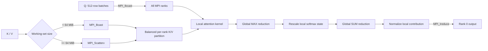

# Distributed Attention Optimization with MPI and AVX-512

A multi-node CPU implementation of scaled dot-product attention,

\[
\mathrm{Attention}(Q,K,V)=\mathrm{softmax}\left(\frac{QK^T}{\sqrt{d_k}}\right)V,
\]

optimized across **distributed communication, SIMD compute, numerical precision, and memory locality**.

On the largest benchmark, the optimized implementation reached **3.31x speedup over the basic MPI baseline** and **7.49x over the serial implementation** using **4 nodes / 64 MPI processes**.

## Results at a glance

| Largest test case (`scale5`) | Result |
| --- | ---: |
| Optimized vs. basic MPI baseline | **3.31x** |
| Optimized vs. serial implementation | **7.49x** |
| Benchmark configuration | **4 nodes x 16 processes/node** |
| Total MPI processes | **64** |

The key result is not one isolated optimization. AVX-512, mixed precision, communication overlap, batching, and data placement become substantially more effective when combined as one end-to-end execution pipeline.

## Parallel design



Each rank owns a balanced subset of K/V rows. Attention is computed with an **online softmax**, so the implementation tracks the running maximum, normalization sum, and weighted V contribution without materializing the full `QK^T` matrix.

Global softmax normalization is reconstructed in two stages: a global maximum establishes a common numerical reference, followed by a global sum for the denominator. This keeps the distributed computation numerically stable across ranks.

## Optimization stack

### 1. AVX-512 compute kernels

The local hot path uses AVX-512 FMA for both dot products and weighted accumulation:

- four independent accumulators process 64 FP32 elements per unrolled dot-product iteration;
- masked loads/stores handle vector tails without a separate padded representation;
- AVX-512/AVX conversion routines vectorize FP64 -> FP32 input conversion and FP32 -> FP64 output conversion;
- `_mm_prefetch` brings the next K/V rows toward cache before they are consumed.

This was the most consistently useful standalone optimization, providing about **1.16x-1.40x** speedup on `scale1` through `scale5`.

### 2. Mixed-precision execution

Inputs and final outputs remain FP64, while the distributed attention computation uses FP32 intermediates. This reduces K/V storage and communication volume and doubles the number of FP32 values handled by a 512-bit vector compared with FP64.

Mixed precision alone is not always faster because conversion overhead can offset the savings. Its main benefit appears when combined with AVX-512 and distributed communication optimizations.

### 3. Communication/computation overlap

Queries are processed in **512-row batches** with ping-pong buffers.

While the current batch is being computed, the next Q batch is prefetched with `MPI_Ibcast`. The previous batch's output reduction can also remain in flight through `MPI_Ireduce` while the next batch progresses. This reduces exposed communication latency on sufficiently large workloads.

### 4. Adaptive K/V distribution

K/V rows are divided almost evenly across ranks, including cases where `n` is not divisible by the MPI world size.

The implementation selects the distribution strategy from the K/V working-set size:

- **below 64 MiB:** broadcast K/V, then extract each rank's local slice;
- **64 MiB and above:** use `MPI_Scatterv` so each rank receives only its partition.

This trades small-message setup overhead against memory and communication volume for larger inputs.

## Performance

### Optimization impact


The standalone results show an important systems-performance lesson: an optimization can be useful even when its isolated benchmark is neutral or slower. Mixed precision and pipeline overlap add overhead by themselves, but they reduce data movement and exposed communication in the complete design. The combined implementation grows from **1.38x at `scale1` to 3.31x at `scale5`** relative to the MPI baseline.

### Parallel vs. serial


MPI is a poor tradeoff for the smallest input because communication dominates useful computation. As the problem grows, the compute-to-communication ratio improves and the distributed implementation reaches **7.49x speedup on `scale5`**.

The benchmark charts reproduce the measurements from the project evaluation on **4 nodes with 16 MPI processes per node**. The original `scale1`-`scale5` benchmark datasets are not included in this portfolio repository; the included generator and smoke tests are intended for correctness and edge-case validation.

## Build and run

### Requirements

- 64-bit Linux
- GCC-compatible C compiler
- MPI 3+ implementation such as Open MPI
- AVX-512F/FMA-capable CPU on every rank for `attention-mpi`
- Python 3 for fixture generation and smoke tests

```bash
make
python3 tools/generate_case.py sample.bin
./attention sample.bin
mpiexec -n 4 ./attention-mpi sample.bin
make test
```

To build only the serial reference:

```bash
make attention
```

To test only the serial implementation:

```bash
python3 tests/smoke.py --serial-only
```

For a real cluster, process placement, host selection, and network transport should be configured through the MPI launcher or scheduler.

## Correctness and timing

Both executables validate their output against the expected result stored in the input fixture. The optimized implementation uses the project's original **0.02 absolute-error tolerance** and rejects non-finite results.

MPI timing uses the maximum elapsed time across ranks. The timed `attention()` region includes conversion, K/V distribution, local computation, collective normalization, and output reduction; it excludes file I/O, verification, and MPI initialization.

Because FP32 intermediates are used internally, converting the final output back to FP64 does not recover precision lost during FP32 computation.

## Repository layout

| Path | Purpose |
| --- | --- |
| `src/attention.c` | FP64 serial reference implementation |
| `src/attention-mpi.c` | Distributed MPI + AVX-512 optimized implementation |
| `src/io.h` | Binary input, validation, and shared error handling |
| `tools/generate_case.py` | Deterministic test-fixture generator with independent FP64 reference |
| `tests/smoke.py` | Tests SIMD tails, uneven/empty partitions, batching, and invalid inputs |
| `assets/` | Performance visualizations used in this README |

## Implementation notes

- The optimized executable intentionally has no non-AVX-512 SIMD fallback.
- Communication overlap depends on MPI progress behavior and the target cluster/network.
- The global MAX/SUM normalization collectives are issued with nonblocking MPI calls but are synchronized before their results are consumed.
- The binary format is native-endian; generate and consume fixtures on machines with the same byte order.
